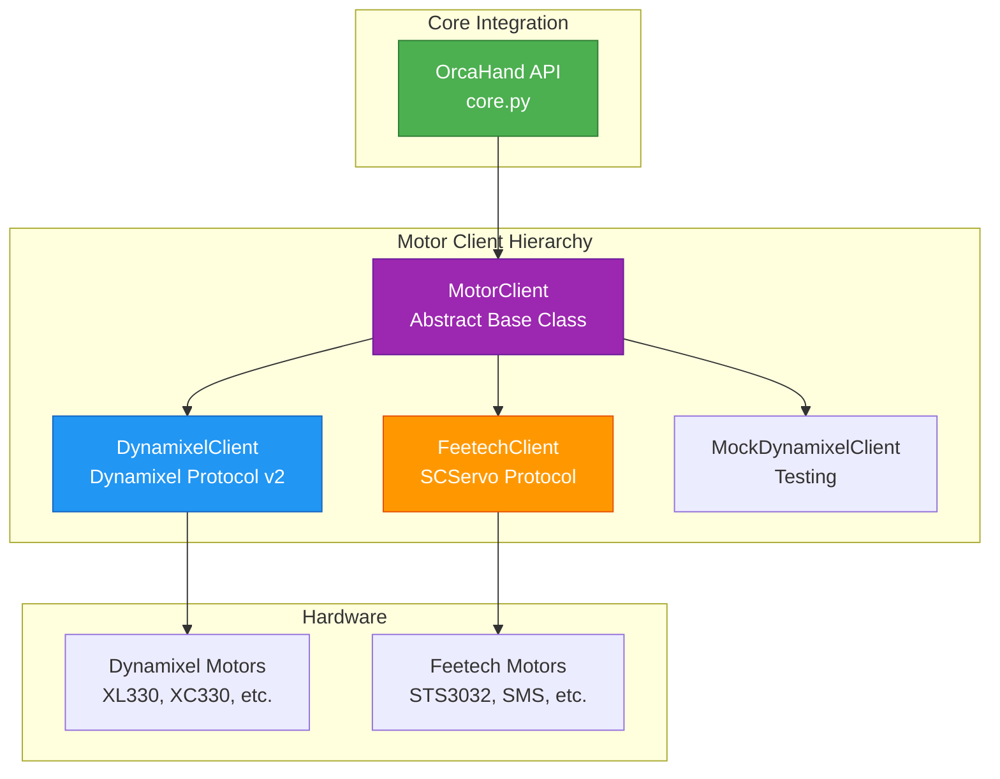
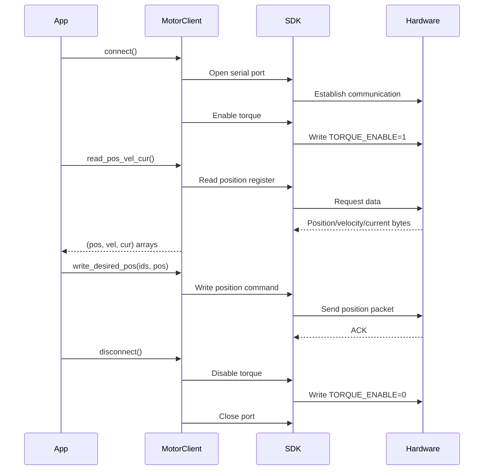

# Motor Client API

The motor client system provides a unified interface for controlling different motor types (Dynamixel, Feetech) in the ORCA Hand.

## Architecture



## Quick Start

```python
# Using Feetech motors directly
from orca_core.hardware.feetech_client import FeetechClient

client = FeetechClient(
    motor_ids=[1, 2, 3, 4, 5],
    port="/dev/ttyUSB0",
    baudrate=1000000
)
client.connect()

# Read motor state
positions, velocities, currents = client.read_pos_vel_cur()
print(f"Position: {positions}")

# Write position
import numpy as np
client.write_desired_pos([1, 2], np.array([1.57, 3.14]))  # radians

client.disconnect()
```

---

## Class: MotorClient (Abstract Base)

`MotorClient` defines the interface that all motor implementations must follow.

```python
from orca_core.hardware.motor_client import MotorClient
```

### Abstract Methods

| Method | Description |
|--------|-------------|
| `connect()` | Establish connection to motors |
| `disconnect()` | Close connection |
| `is_connected` | Property: connection status |
| `set_torque_enabled()` | Enable/disable motor torque |
| `set_operating_mode()` | Set control mode |
| `read_pos_vel_cur()` | Read position, velocity, current |
| `read_temperature()` | Read motor temperatures |
| `write_desired_pos()` | Command target positions |
| `write_desired_current()` | Command target currents |

### Operating Modes

| Mode | Value | Description |
|------|-------|-------------|
| Current | 0 | Direct current/torque control |
| Velocity | 1 | Velocity control |
| Position | 3 | Position control |
| Multi-turn | 4 | Extended position control |
| Current-based Position | 5 | Position with current limit |

---

## Class: FeetechClient

Client for Feetech SMS/STS series servo motors.

```python
from orca_core.hardware.feetech_client import FeetechClient
```

### Constructor

```python
FeetechClient(
    motor_ids: Sequence[int],
    port: str = '/dev/ttyUSB0',
    baudrate: int = 1000000,
    lazy_connect: bool = False,
    pos_scale: Optional[float] = None,
    vel_scale: Optional[float] = None,
    cur_scale: Optional[float] = None,
)
```

| Parameter | Type | Default | Description |
|-----------|------|---------|-------------|
| `motor_ids` | Sequence[int] | required | List of motor IDs to control |
| `port` | str | `/dev/ttyUSB0` | Serial port path |
| `baudrate` | int | 1000000 | Communication baud rate |
| `lazy_connect` | bool | False | Auto-connect on first operation |
| `pos_scale` | float | 2π/4095 | Position conversion (rad/unit) |
| `vel_scale` | float | 0.732 | Velocity conversion (rpm/unit) |
| `cur_scale` | float | 6.5 | Current conversion (mA/unit) |

### Connection Methods

#### connect()

```python
connect() -> None
```

Connect to motors and enable torque.

**Raises:**
- `RuntimeError`: If already connected
- `OSError`: If serial port cannot be opened

**Example:**
```python
client = FeetechClient([1, 2, 3], port="/dev/ttyUSB0")
client.connect()
print(f"Connected: {client.is_connected}")
```

---

#### disconnect()

```python
disconnect() -> None
```

Disable torque and close connection. Safe to call multiple times.

---

#### is_connected

```python
@property
is_connected -> bool
```

Returns `True` if connected to motors.

---

### Torque Control

#### set_torque_enabled()

```python
set_torque_enabled(
    motor_ids: Sequence[int],
    enabled: bool,
    retries: int = -1,
    retry_interval: float = 0.25
) -> None
```

Enable or disable torque for specified motors.

| Parameter | Type | Default | Description |
|-----------|------|---------|-------------|
| `motor_ids` | Sequence[int] | required | Motor IDs to configure |
| `enabled` | bool | required | True to enable, False to disable |
| `retries` | int | -1 | Retry count (-1 = infinite) |
| `retry_interval` | float | 0.25 | Seconds between retries |

**Example:**
```python
# Enable torque for motors 1-3
client.set_torque_enabled([1, 2, 3], True)

# Disable torque with limited retries
client.set_torque_enabled([1, 2, 3], False, retries=3)
```

---

### Operating Mode

#### set_operating_mode()

```python
set_operating_mode(motor_ids: Sequence[int], mode: int) -> None
```

Set the operating mode for motors.

Feetech servos have two native modes:
- Mode 0: Servo (position control)
- Mode 1: Wheel (velocity control)

This method maps Dynamixel mode values to Feetech equivalents:

| Input Mode | Feetech Mode | Behavior |
|------------|--------------|----------|
| 0 (current) | 0 (servo) | Position with torque limit |
| 1 (velocity) | 1 (wheel) | Continuous rotation |
| 3 (position) | 0 (servo) | Standard position |
| 5 (current-based) | 0 (servo) | Position with torque limit |

**Example:**
```python
# Set to position mode
client.set_operating_mode([1, 2, 3], 3)

# Set to velocity mode
client.set_operating_mode([4, 5], 1)
```

---

### Reading State

#### read_pos_vel_cur()

```python
read_pos_vel_cur() -> Tuple[np.ndarray, np.ndarray, np.ndarray]
```

Read position, velocity, and current for all motors.

**Returns:** Tuple of three numpy arrays:
- `positions`: Motor positions in radians
- `velocities`: Motor velocities in rpm
- `currents`: Motor currents in mA

Arrays are ordered by `motor_ids` from constructor.

**Example:**
```python
positions, velocities, currents = client.read_pos_vel_cur()
for i, motor_id in enumerate(client.motor_ids):
    print(f"Motor {motor_id}: pos={positions[i]:.2f} rad, "
          f"vel={velocities[i]:.1f} rpm, cur={currents[i]:.1f} mA")
```

---

#### read_temperature()

```python
read_temperature() -> np.ndarray
```

Read temperature for all motors.

**Returns:** Array of temperatures in degrees Celsius.

**Example:**
```python
temps = client.read_temperature()
for i, motor_id in enumerate(client.motor_ids):
    print(f"Motor {motor_id}: {temps[i]:.0f}°C")
```

---

### Writing Commands

#### write_desired_pos()

```python
write_desired_pos(
    motor_ids: Sequence[int],
    positions: np.ndarray
) -> None
```

Command target positions for specified motors.

| Parameter | Type | Description |
|-----------|------|-------------|
| `motor_ids` | Sequence[int] | Motors to command |
| `positions` | np.ndarray | Target positions in radians |

**Raises:**
- `ValueError`: If `motor_ids` and `positions` have different lengths

**Example:**
```python
import numpy as np

# Move motors 1 and 2 to 90° and 180°
client.write_desired_pos([1, 2], np.array([np.pi/2, np.pi]))
```

---

#### write_desired_current()

```python
write_desired_current(
    motor_ids: Sequence[int],
    currents: np.ndarray
) -> None
```

Set current/torque limits for specified motors.

**Note:** Feetech servos don't have direct current control. This sets the torque limit via the Goal Time register.

| Parameter | Type | Description |
|-----------|------|-------------|
| `motor_ids` | Sequence[int] | Motors to configure |
| `currents` | np.ndarray | Current limits in mA |

**Example:**
```python
# Set 500mA torque limit for motors 1-3
client.write_desired_current([1, 2, 3], np.array([500, 500, 500]))
```

---

### Context Manager

FeetechClient supports context manager usage:

```python
with FeetechClient([1, 2, 3], port="/dev/ttyUSB0") as client:
    positions, _, _ = client.read_pos_vel_cur()
    print(positions)
# Automatically disconnects
```

---

## Class: DynamixelClient

Client for Dynamixel servo motors (Protocol v2).

```python
from orca_core.hardware.dynamixel_client import DynamixelClient
```

### Constructor

```python
DynamixelClient(
    motor_ids: Sequence[int],
    port: str = '/dev/ttyUSB0',
    baudrate: int = 1000000,
    lazy_connect: bool = False,
    pos_scale: Optional[float] = None,
    vel_scale: Optional[float] = None,
    cur_scale: Optional[float] = None,
)
```

| Parameter | Type | Default | Description |
|-----------|------|---------|-------------|
| `motor_ids` | Sequence[int] | required | List of motor IDs to control |
| `port` | str | `/dev/ttyUSB0` | Serial port path |
| `baudrate` | int | 1000000 | Communication baud rate |
| `lazy_connect` | bool | False | Auto-connect on first operation |
| `pos_scale` | float | 2π/4096 | Position conversion (rad/unit) |
| `vel_scale` | float | 0.229×2π/60 | Velocity conversion |
| `cur_scale` | float | 1.34 | Current conversion (mA/unit) |

### Additional Methods

DynamixelClient includes all MotorClient methods plus:

#### sync_write()

```python
sync_write(
    motor_ids: Sequence[int],
    values: Sequence[Union[int, float]],
    address: int,
    size: int
) -> None
```

Write values to multiple motors simultaneously using sync write.

---

#### write_profile_velocity()

```python
write_profile_velocity(
    motor_ids: Sequence[int],
    profile_velocity: np.ndarray
) -> None
```

Set the profile velocity for position moves.

---

#### read_status_is_done_moving()

```python
read_status_is_done_moving() -> bool
```

Check if motors have finished moving to their target positions.

---

## Data Flow



---

## Hardware Specifications

### Feetech STS3032

| Specification | Value |
|---------------|-------|
| Operating Voltage | 6-12.6V DC |
| Stall Torque | 3.5 kg·cm @ 7.4V |
| No-load Speed | 0.14 sec/60° @ 7.4V |
| Position Range | 0-4095 (360°) |
| Position Resolution | ~0.088° |
| Communication | Half-duplex TTL |
| Baud Rate | Up to 1 Mbps |
| Feedback | Position, Speed, Current, Voltage, Temperature |

### Dynamixel XL330

| Specification | Value |
|---------------|-------|
| Operating Voltage | 5-9V DC |
| Stall Torque | 0.65 N·m @ 7.4V |
| No-load Speed | 76 rpm @ 7.4V |
| Position Range | 0-4095 (360°) |
| Position Resolution | ~0.088° |
| Communication | Half-duplex TTL |
| Baud Rate | Up to 4 Mbps |
| Feedback | Position, Velocity, Current, Voltage, Temperature |

---

## Complete Example

```python
from orca_core.hardware.feetech_client import FeetechClient
import numpy as np
import time

def main():
    # Initialize client
    motor_ids = [1, 2, 3, 4, 5]
    client = FeetechClient(
        motor_ids=motor_ids,
        port="/dev/ttyUSB0",
        baudrate=1000000
    )

    try:
        # Connect
        client.connect()
        print(f"Connected to {len(motor_ids)} motors")

        # Read initial state
        positions, velocities, currents = client.read_pos_vel_cur()
        print(f"Initial positions: {np.degrees(positions)}")

        # Read temperatures
        temps = client.read_temperature()
        print(f"Temperatures: {temps}°C")

        # Move to center position (180°)
        target = np.full(len(motor_ids), np.pi)
        client.write_desired_pos(motor_ids, target)
        print("Moving to center position...")

        # Wait and read final position
        time.sleep(2.0)
        positions, _, _ = client.read_pos_vel_cur()
        print(f"Final positions: {np.degrees(positions)}")

    except OSError as e:
        print(f"Connection error: {e}")
    finally:
        client.disconnect()
        print("Disconnected")

if __name__ == "__main__":
    main()
```

---

## Troubleshooting

### Connection Errors

| Error | Cause | Solution |
|-------|-------|----------|
| "Failed to open port" | Port not found or in use | Check cable, verify port path |
| "Must call connect() first" | Operating without connection | Call `connect()` before operations |
| "Client is already connected" | Double connect | Check connection state first |

### Communication Errors

| Error | Cause | Solution |
|-------|-------|----------|
| Timeout on read | Motor not responding | Check power, ID, baud rate |
| Checksum error | Electrical interference | Shorten cables, add shielding |
| Wrong data values | Scale factor mismatch | Verify pos_scale, vel_scale |

### Motor Behavior

| Issue | Cause | Solution |
|-------|-------|----------|
| Motor doesn't move | Torque disabled | Call `set_torque_enabled()` |
| Jerky motion | Wrong acceleration | Adjust internal `_default_acc` |
| Position drift | Calibration needed | Recalibrate motor offsets |
