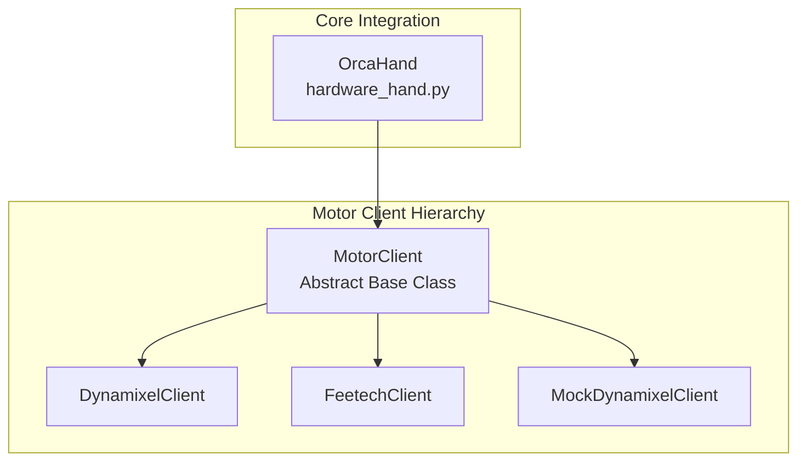

# Motor Client API

The motor client layer is the low-level hardware abstraction underneath the refactored `OrcaHand` API.

## Architecture


```mermaid
graph TB
    subgraph "Motor Client Hierarchy"
        ABC[MotorClient<br/>Abstract Base Class]
        DYN[DynamixelClient]
        FEE[FeetechClient]
        MOCK[MockDynamixelClient]
    end

    subgraph "Core Integration"
        ORCA[OrcaHand<br/>hardware_hand.py]
    end

    ABC --> DYN
    ABC --> FEE
    ABC --> MOCK
    ORCA --> ABC
```

## Quick Start

Most users should work with `OrcaHand`, not with a motor client directly:

```python
from orca_core import OrcaHand

hand = OrcaHand(config_path="orca_core/models/v2/orcahand_right/config.yaml")
success, message = hand.connect()
if success:
    hand.init_joints()
```

You only need the motor client layer directly if you are debugging the bus or adding a new backend.

---

## Class: MotorClient (Abstract Base)

`MotorClient` defines the interface that all motor implementations must follow.

```python
from orca_core.hardware.motor_client import MotorClient
```

### Abstract Methods

| Method | Description |
|--------|-------------|
| `connect()` | Establish connection to motors |
| `disconnect()` | Close connection |
| `is_connected` | Property: connection status |
| `set_torque_enabled()` | Enable or disable motor torque |
| `set_operating_mode()` | Set control mode |
| `read_pos_vel_cur()` | Read position, velocity, and current |
| `read_temperature()` | Read motor temperatures |
| `write_desired_pos()` | Command target positions |
| `write_desired_current()` | Command target currents |
| `calibrate_offset()` | Optional hook for backends that need offset calibration |

### Operating Modes

`OrcaHand` maps named control modes to the integer values expected by the motor backend:

| Mode | Value | Description |
|------|-------|-------------|
| Current | 0 | Direct current / torque mode |
| Velocity | 1 | Velocity control |
| Position | 3 | Position control |
| Multi-turn | 4 | Extended position control |
| Current-based Position | 5 | Position control with current limiting |

---

## Concrete Clients

The current repository ships three relevant implementations:

- `DynamixelClient`
- `FeetechClient`
- `MockDynamixelClient`

`OrcaHand` chooses the right backend from `config.motor_type`, so the higher-level hand API stays the same across supported motor families.

---

## How It Fits the Refactor

The important separation in the current codebase is:

- `MotorClient` handles raw bus communication
- `OrcaHand` handles joint-space conversion, calibration state, torque workflow, and operator tasks
- `OrcaHandConfig` and `CalibrationResult` hold the structured data that drive those behaviors
